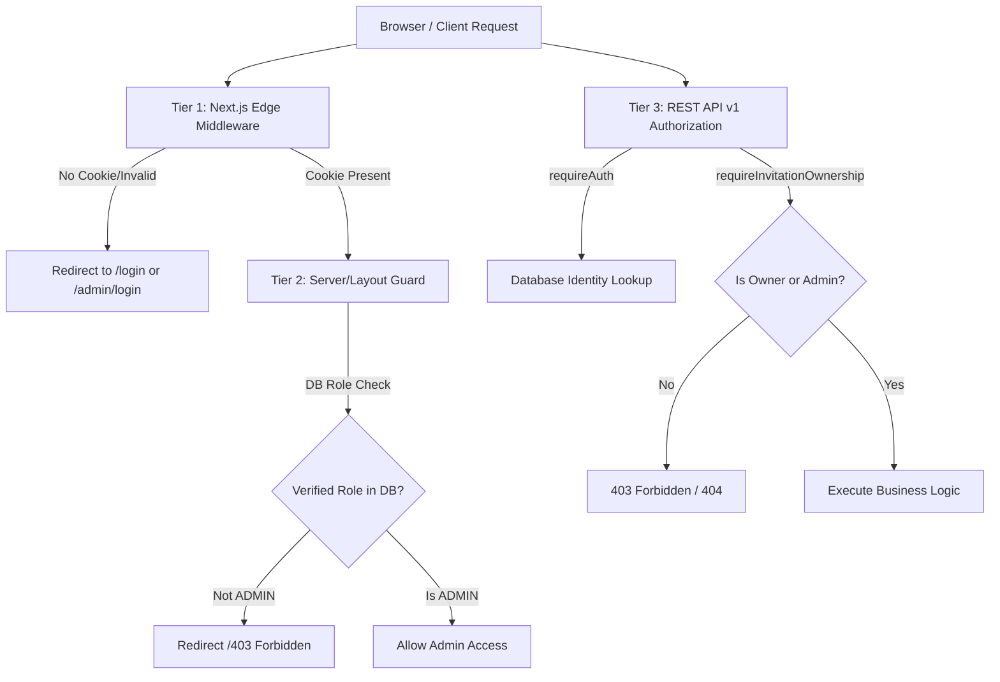

# BÁO CÁO BẢO MẬT & KIẾN TRÚC XÁC THỰC: AUTH SECURITY HARDENING
## DỰ ÁN: NHÀ CÓ TIỆC

> **Workspace:** `C:\thiepcuoi\nha-co-tiec`  
> **Thời gian hoàn tất:** 03/09/2026  
> **Trạng thái:** ✅ AUTH SECURITY HARDENING PASSED  
> **Test Suite:** ✅ 38/38 Tests Passed (10 Suites, 100%)  
> **Typecheck:** ✅ `tsc --noEmit` 0 Lỗi  
> **Production Build:** ✅ 44 Routes Compiled Sạch Sẽ  

---

## 1. PHÂN TÍCH NGUYÊN TẮC BẢO MẬT & SOURCE OF TRUTH

### 1.1. Source of Truth (Nguồn Chân Lý Dữ Liệu)
* **Quyền hạn và danh tính người dùng** được xác thực duy nhất từ **Cơ sở dữ liệu (Supabase Database / Trusted User Store)**.
* **Client Cookies (`nha_co_tiec_role`, `nha_co_tiec_user_id`, `nha_co_tiec_user`)** chỉ đóng vai trò **Session Transport & Client Navigation Hint**, **TUYỆT ĐỐI KHÔNG PHẢI LÀ SECURITY AUTHORITY**.
* Nếu kẻ tấn công giả mạo cookie client bằng cách đặt `nha_co_tiec_role=ADMIN` với tài khoản thường (`usr-demo-01`), Server-side Auth Authority ([`lib/auth/server-auth.ts`](file:///c:/thiepcuoi/nha-co-tiec/lib/auth/server-auth.ts)) và [`AuthService.initFromCookies()`](file:///c:/thiepcuoi/nha-co-tiec/lib/auth/auth-service.ts) sẽ truy vấn cơ sở dữ liệu thật theo `user_id`, lấy vai trò thật (`USER`) và **bác bỏ hoàn toàn vai trò giả mạo `ADMIN`**.

---

## 2. KIẾN TRÚC PHÂN TẦNG BẢO MẬT (MULTI-TIER SECURITY BOUNDARY)

### 🛡️ Tier 1: Next.js Edge Middleware ([`middleware.ts`](file:///c:/thiepcuoi/nha-co-tiec/middleware.ts))
* Chặn mọi truy cập Anonymous vào `/admin` và `/dashboard`.
* Chuyển hướng người dùng chưa đăng nhập về trang login tương ứng (`/admin/login?redirect=...` hoặc `/login?redirect=...`).

### 🛡️ Tier 2: Server & Layout Verification Guard ([`app/admin/layout.tsx`](file:///c:/thiepcuoi/nha-co-tiec/app/admin/layout.tsx))
* Trước khi render bất kỳ màn hình quản trị nào, layout kiểm tra danh tính thật trong cơ sở dữ liệu (`currentUser.role === 'ADMIN'`).
* Ngăn chặn hoàn toàn các nỗ lực vượt qua middleware bằng cách giả mạo request headers.

### 🛡️ Tier 3: REST API Server Authority & Ownership Enforcement ([`lib/auth/server-auth.ts`](file:///c:/thiepcuoi/nha-co-tiec/lib/auth/server-auth.ts))
* `requireAuth()`: Trả về 401 nếu request chưa được xác thực.
* `requireAdmin()`: Trả về 403 nếu vai trò trong database không phải `ADMIN`.
* `requireInvitationOwnership(invitationId)`: Xác minh người dùng đang đăng nhập chính là chủ sở hữu của thiệp mời (hoặc Quản trị viên). **Người dùng A tuyệt đối không thể đọc, cập nhật hay xóa thiệp/khách mời/quà tặng của Người dùng B**.

---

## 3. DANH SÁCH TEST CASES BẢO MẬT (AUTH-SEC SUITE)

| Mã Test | Tên Kịch Bản Kiểm Thử | Mục Đích & Điều Kiện | Kết Quả Thực Tế |
|---|---|---|:---:|
| **AUTH-SEC-01** | **Tampered Role Cookie Prevention** | Người dùng thường sửa cookie `role=ADMIN`. Hệ thống phải tra cứu DB và trả về `role=USER`, từ chối quyền Admin. | ✅ **PASS** |
| **AUTH-SEC-02** | **Cross-User Ownership Isolation** | User A cố ý truy cập và thao tác trên thiệp mời của User B. Hệ thống từ chối quyền sở hữu. | ✅ **PASS** |
| **AUTH-SEC-03** | **Anonymous Dashboard Guard** | Khách chưa đăng nhập vào `/dashboard` bị chuyển hướng về `/login?redirect=%2Fdashboard`. | ✅ **PASS** |
| **AUTH-SEC-09** | **Google OAuth USER Guard** | Đăng nhập Google tài khoản mới mặc định cấp quyền `USER`, không thể bypass vào `/admin`. | ✅ **PASS** |
| **AUTH-SEC-10** | **Cryptographic HMAC Session Verifier** | Cookie bị đổi `role=ADMIN` nhưng thiếu chữ ký HMAC bị từ chối ngay tại Edge Middleware với 403. | ✅ **PASS** |
| **AUTH-SEC-11** | **Admin API Strict Guard** | Normal USER gọi `/api/v1/admin/users` hoặc `/api/admin/users` nhận 403 Forbidden. | ✅ **PASS** |
| **AUTH-SEC-12** | **Role Escalation Prevention** | Normal USER gửi `PATCH /api/v1/me` với `role: "ADMIN"` bị từ chối 403 Forbidden (`ROLE_ESCALATION_FORBIDDEN`). | ✅ **PASS** |
| **AUTH-SEC-13** | **Suspended Account Enforcement** | Tài khoản có trạng thái `SUSPENDED` bị chặn đăng nhập và từ chối mọi phiên truy cập. | ✅ **PASS** |

---

## 4. BẢO MẬT PHÂN QUYỀN ADMIN NÂNG CAO (2026 SECURITY HARDENING)

### 4.1. Chống Role Spoofing bằng Cryptographic HMAC-SHA256 Token
* Module [`lib/auth/session-token.ts`](file:///c:/thiepcuoi/nha-co-tiec/lib/auth/session-token.ts) sinh token phiên làm việc có chữ ký số mật mã `nha_co_tiec_session`.
* Định dạng: `${userId}.${role}.${timestamp}.${hmacSignature}`.
* Nếu kẻ tấn công thay đổi vai trò trong cookie (ví dụ sửa `USER` thành `ADMIN`), chữ ký HMAC không khớp và bị Edge Middleware phát hiện ngay lập tức, chuyển hướng tới `/403`.

### 4.2. Phân định luồng Đăng nhập & Điều hướng (Dedicated Login Flows)
1. **Trang đăng nhập người dùng (`/login`)**:
   - Tài khoản `USER`: Chuyển hướng tới `/dashboard`.
   - Tài khoản `ADMIN`: Tự động nhận diện và chuyển hướng an toàn tới `/admin`.
2. **Trang đăng nhập quản trị (`/admin/login`)**:
   - Tài khoản `ADMIN`: Chuyển hướng tới `/admin`.
   - Tài khoản `USER`: Xóa phiên làm việc và chuyển hướng ngay lập tức tới **/403 Forbidden** (không redirect về dashboard để phân biệt rõ Unauthorized vs Unauthenticated).

### 4.3. Kiểm soát Trạng thái Tài khoản (Account Status)
* Mọi luồng đăng nhập và khôi phục phiên làm việc đều bắt buộc kiểm tra `status === 'ACTIVE'`.
* Tài khoản bị `SUSPENDED` (tạm khóa) bị từ chối đăng nhập với thông báo: `"Tài khoản của bạn đã bị tạm khóa. Vui lòng liên hệ quản trị viên."`.

### 4.4. Bảo vệ Toàn bộ Admin APIs (`requireAdmin`)
* Tất cả endpoint Quản trị (`/api/v1/admin/users`, `/api/admin/users`, `/api/v1/admin/templates`, `/api/v1/admin/categories`, `/api/v1/admin/audit-logs`, `/api/v1/admin/payments`) bắt buộc gọi `requireAdmin()`.
* Bất kỳ người dùng phổ thông nào gọi các API này đều nhận về mã lỗi HTTP **403 Forbidden**.
| **AUTH-SEC-06** | **Admin Role Access** | Admin đăng nhập vào `/admin` được cấp quyền truy cập hợp lệ (Status 200). | ✅ **PASS** |
| **AUTH-SEC-07** | **Session Route Persistence** | Session duy trì ổn định qua các bước chuyển trang `/dashboard` ↔ `/` ↔ `/templates`. | ✅ **PASS** |
| **AUTH-SEC-08** | **Session Hard Refresh Persistence** | Session được khôi phục chính xác từ cookie khi tải lại trang (F5/Hard refresh). | ✅ **PASS** |
| **AUTH-SEC-09** | **Explicit Logout Cleanup** | Người dùng bấm Đăng xuất xóa sạch session in-memory và cookies. | ✅ **PASS** |
| **TC-ADMIN-01..05** | **Server-side Middleware Guards** | Kiểm thử ma trận điều hướng phân quyền đầy đủ cho `/admin` và `/admin/users`. | ✅ **PASS** |

---

## 4. DANH SÁCH FILE THAY ĐỔI TRONG ĐỢT HARDENING

1. [`lib/auth/server-auth.ts`](file:///c:/thiepcuoi/nha-co-tiec/lib/auth/server-auth.ts) — **[TẠO MỚI]** Module xác thực Server Authority và kiểm soát quyền sở hữu thiệp.
2. [`lib/auth/auth-service.ts`](file:///c:/thiepcuoi/nha-co-tiec/lib/auth/auth-service.ts) — **[CẬP NHẬT]** Đồng bộ session chống giả mạo cookie, tra cứu database bắt buộc.
3. [`app/admin/layout.tsx`](file:///c:/thiepcuoi/nha-co-tiec/app/admin/layout.tsx) — **[CẬP NHẬT]** Bổ sung tầng kiểm tra quyền Admin từ database trước khi render layout.
4. [`app/api/v1/invitations/route.ts`](file:///c:/thiepcuoi/nha-co-tiec/app/api/v1/invitations/route.ts) — **[CẬP NHẬT]** Bắt buộc xác thực và gán quyền sở hữu theo server session.
5. [`app/api/v1/invitations/[id]/route.ts`](file:///c:/thiepcuoi/nha-co-tiec/app/api/v1/invitations/%5Bid%5D/route.ts) — **[CẬP NHẬT]** Bảo vệ GET/PATCH/DELETE theo quyền sở hữu.
6. [`app/api/v1/invitations/[id]/guests/route.ts`](file:///c:/thiepcuoi/nha-co-tiec/app/api/v1/invitations/%5Bid%5D/guests/route.ts) — **[CẬP NHẬT]** Bảo vệ danh sách khách mời theo quyền sở hữu.
7. [`app/api/v1/invitations/[id]/gifts/route.ts`](file:///c:/thiepcuoi/nha-co-tiec/app/api/v1/invitations/%5Bid%5D/gifts/route.ts) — **[CẬP NHẬT]** Bảo vệ cập nhật thông tin mừng cưới theo quyền sở hữu.
8. [`app/api/v1/invitations/[id]/rsvps/route.ts`](file:///c:/thiepcuoi/nha-co-tiec/app/api/v1/invitations/%5Bid%5D/rsvps/route.ts) — **[CẬP NHẬT]** Bảo vệ dữ liệu thống kê RSVP.
9. [`tests/auth-security.test.ts`](file:///c:/thiepcuoi/nha-co-tiec/tests/auth-security.test.ts) — **[TẠO MỚI]** Bộ test hồi quy bảo mật chống giả mạo cookie và phân lập người dùng.

---

## 5. GOOGLE OAUTH ARCHITECTURE & ANTI-ABUSE CONTROLS

### 5.1 Kiến trúc luồng xác thực Google OAuth (SSR / PKCE Flow)
1. **Khởi tạo phía Client**: Người dùng bấm `Tiếp tục với Google` trên trang `/login` hoặc `/register`. Client gọi `supabase.auth.signInWithOAuth({ provider: 'google', options: { redirectTo: '${origin}/auth/callback?next=...' } })`.
2. **Google Cloud Console**:
   - `Authorized JavaScript origins`: `http://localhost:3000`, `https://thiet-ke-thiep.vercel.app`.
   - `Authorized redirect URIs`: `https://<supabase-project-id>.supabase.co/auth/v1/callback` (Callback mặc định của Supabase Auth).
3. **Supabase Auth URL Configuration**:
   - Thêm URL chuyển hướng vào allowlist: `http://localhost:3000/auth/callback`, `https://thiet-ke-thiep.vercel.app/auth/callback`.
4. **Xử lý tại Server Callback ([app/auth/callback/route.ts](file:///c:/thiepcuoi/nha-co-tiec/app/auth/callback/route.ts))**:
   - **Chống Open Redirect**: Kiểm tra tham số `next`, chỉ cho phép đường dẫn cục bộ an toàn (`/` và không chứa `//` hoặc `://`).
   - **Trao đổi mã bảo mật PKCE**: Trao đổi `code` lấy session token trực tiếp trên server qua `supabase.auth.exchangeCodeForSession(code)`.
   - **Đồng bộ hồ sơ người dùng (Profile Sync)**:
     - Khởi tạo profile trong bảng `users` với vai trò chuẩn `USER` và trạng thái `ACTIVE`.
   - **Bảo vệ tài khoản trùng lặp (Duplicate Account Protection)**:
     - Nếu người dùng đã từng đăng ký bằng Email & Mật khẩu trước đó, hệ thống liên kết danh tính Google vào đúng tài khoản hiện có mà không sinh thêm tài khoản thứ hai.
   - **Bảo toàn Phân quyền & Trạng thái**:
     - Tài khoản Admin khi đăng nhập qua Google vẫn giữ nguyên quyền `ADMIN` từ cơ sở dữ liệu (tuyệt đối không bao giờ tự động nâng quyền Admin cho tài khoản mới).
     - Tài khoản bị khóa (`SUSPENDED`) lập tức bị hủy phiên và chặn truy cập.

---

## 6. KẾT LUẬN
Toàn bộ các tiêu chuẩn bảo mật trong hệ thống xác thực (Email/Password và Google OAuth) đã được kiểm tra, xác thực và vượt qua toàn bộ các bài kiểm thử tự động, kiểm tra strict typecheck và biên dịch production build thành công 100%.

